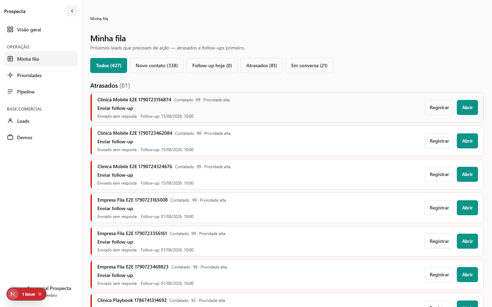
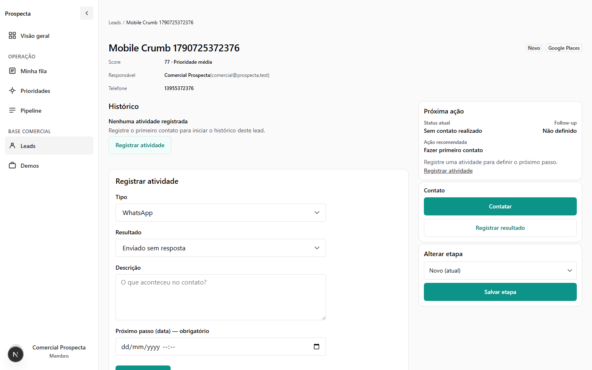
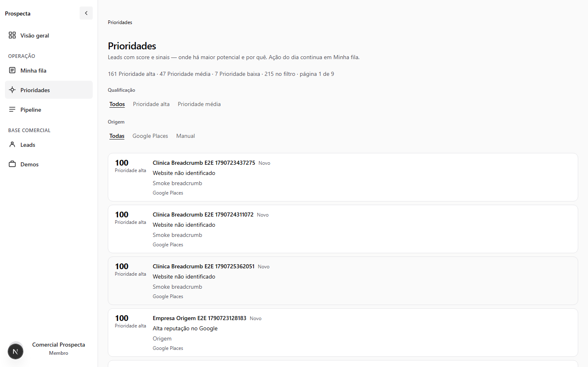
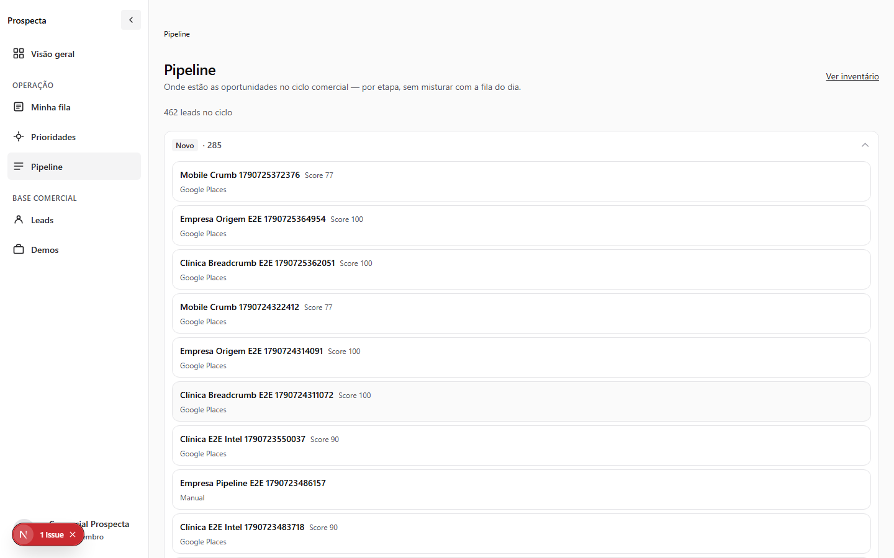
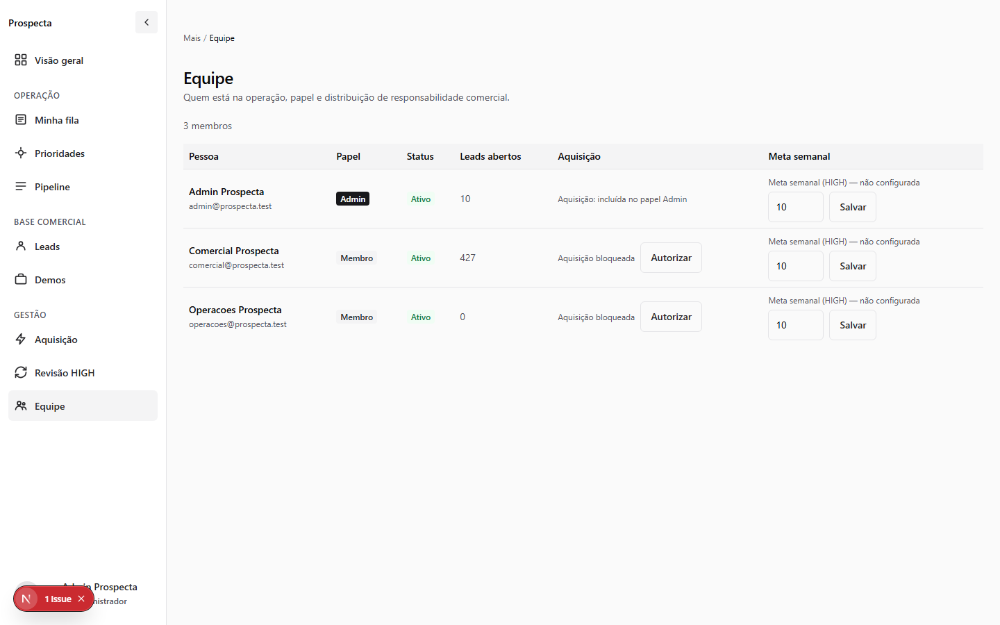
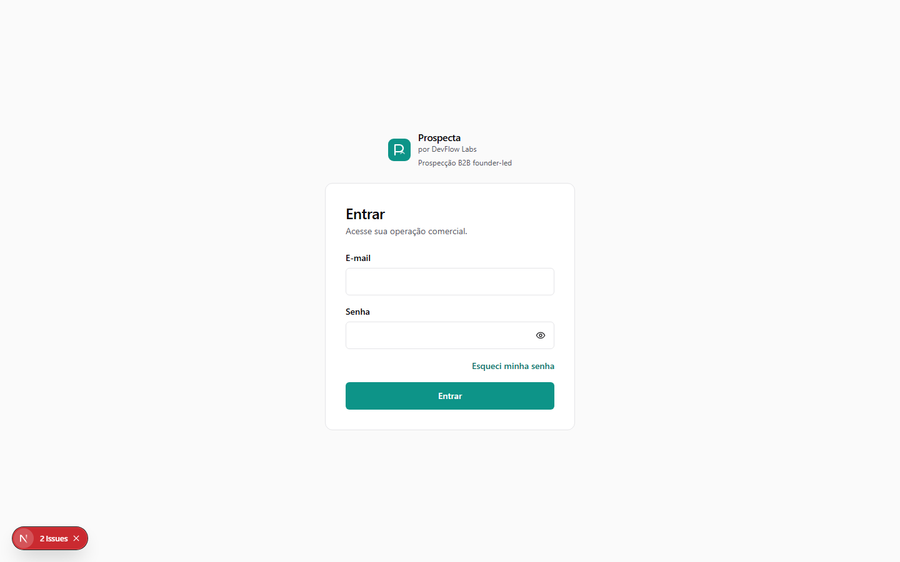
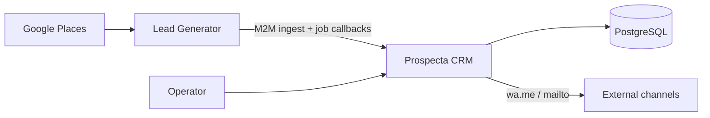

# Prospecta

Operational **B2B prospecting CRM** for founder-led outbound: own acquired leads,
decide what deserves attention, act through WhatsApp (`wa.me`) / e-mail, persist
contact history, and move pipeline state.

This repository is the **CRM system of record**. Acquisition and Score V2
qualification run in a sibling generator; the CRM owns ingestion, weekly
assignment, operator workflows, activities, and ACL.

[Live application](https://prospecta-ten-tau.vercel.app) (login required) ·
[Engineering Case](docs/prospecta/PROSPECTA_ENGINEERING_CASE.md) ·
[ADRs](docs/adr/)



*Minha fila: overdue and follow-up work first — not a generic contacts list.*

## Problem

Outbound stalls when inventory, priority, urgency, and pipeline state share one
screen — or when a channel click is treated as contact. Operators need ownership,
a clear next action, and a durable history of what actually happened.

Prospecta separates those concerns into intentional surfaces, then hardens them
with server-side authorization, bounded lists, and release-level tests.

## Product workflow

```text
Acquisition (Places → generator)
        ↓
M2M ingest + weekly HIGH assignment
        ↓
Prioridades / Minha fila / Leads
        ↓
Lead Detail → wa.me / mailto + Activity
        ↓
Pipeline → WON / LOST
```

**Demos** is a commercial showcase of example sites. It is not the weekly
portfolio (**Carteira** / `WeeklyPortfolio`), which allocates HIGH capacity to
operators.

## Product surfaces

| Surface | Responsibility |
| --- | --- |
| **Minha fila** | What needs action now (overdue, due today, no contact) |
| **Leads** | Inventory and search |
| **Prioridades** | Highest commercial potential and qualification evidence |
| **Pipeline** | Lifecycle stage |
| **Lead Detail** | Operational record: identity, next action, activity history |
| **Equipe** | ADMIN operation: users, ownership signals, acquisition entry |
| **Demos** | Static commercial showcase |

## Product evidence



*Lead Detail: next action and persisted activity — channel clicks alone are not contact.*



*Prioridades: ranked decision support from stored score / qualification signals (Score V2 — not an ML model in this CRM).*



*Pipeline: stage lifecycle without duplicating inventory or urgency semantics.*



*Equipe: ADMIN ownership and operational controls (not an HR product).*



*Auth: session entry for operators — login required for the live app.*

## Architecture



Inside the CRM:

```text
Browser → Next.js App Router → server actions / route handlers
        → services → repositories → PostgreSQL
```

Acquisition contracts: [ADR 0009](docs/adr/0009-google-places-lead-ingestion.md) ·
[ADR 0010](docs/adr/0010-lead-intelligence-pipeline.md) ·
[ADR 0014](docs/adr/0014-acquisition-runner-contract.md)

Sibling: [`TraffikPro/prospecta-lead-generator`](https://github.com/TraffikPro/prospecta-lead-generator)

## Engineering decisions

1. **Activity as truth** — `wa.me` / `mailto` handoff is not proof of contact.
   Persisted `Activity` is the operational source of truth.
2. **Server-side ADMIN / MEMBER scope** — HttpOnly session cookie backed by a
   `Session` row; ownership and role checks run on the server, not only in UI.
3. **Separated work surfaces** — Fila (urgency), Leads (inventory), Prioridades
   (potential), Pipeline (stage) so operators do not confuse “what exists” with
   “what to do now”.
4. **Leads pagination** — server page size **25** for inventory-scale lists.
5. **Minha fila tradeoff** — urgency sections need the relevant open-stage set
   for correct buckets; UI render is capped (**20** rows per section). Full-set
   retrieval cost remains acknowledged debt.
6. **Prioridades ranking** — authoritative score lives in lead `intelligence`
   JSON; ranking loads a candidate set then applies a page slice. Correct
   ordering today; not yet a pure SQL `ORDER BY` path.
7. **Safe local QA** — Docker Postgres, empty Upstash in development, seed and
   mutation guards that refuse known production database fingerprints.

## Authorization

- Email/password login; session stored in PostgreSQL
- Cookie: `prospecta_session` (dev) / `__Secure-prospecta_session` (prod) —
  HttpOnly, SameSite=Lax, Secure in production
- App roles: `ADMIN` | `MEMBER` (distinct from founding partnership roles)
- Route and action guards enforce auth, role, and lead ownership on the server
- Machine-to-machine Bearer tokens for lead ingest and acquisition job callbacks

Details: [ADR 0005](docs/adr/0005-auth-sessions-acl-v1.md)

## Quality

Validated Product UI V2 release candidate (local Docker QA):

| Check | Result |
| --- | --- |
| Automated tests (`src/**/*.test.ts`, Node test runner) | **374** passed |
| Playwright E2E (serial) | **50** passed, **0** retries |
| Typecheck / lint / build | PASS |

Also exercised: ADMIN/MEMBER role QA, desktop / medium / mobile visual QA, and
safe local environment guards. Evidence:
[F14 release report](docs/audits/PROSPECTA_PRODUCT_UI_F14_RELEASE_REPORT.md) ·
[Engineering Case](docs/prospecta/PROSPECTA_ENGINEERING_CASE.md)

CI on `main` / PRs: Postgres tests, lint, typecheck, build, plus security gates
(Gitleaks, dependency audit, CodeQL).

## Stack

| Layer | Choice |
| --- | --- |
| Frontend | Next.js App Router, React, Chakra UI v3, TypeScript |
| Backend | Next.js server actions & route handlers (no separate Express BFF) |
| Data | PostgreSQL 16, Prisma |
| Auth / limits | Session table + cookies; Upstash rate limit in production (fail-closed) |
| Testing | Node `tsx --test`, Playwright |
| Tooling | pnpm, Docker Compose, GitHub Actions |

## Run locally

Use **local Docker Postgres**. Do not point day-to-day QA at production Neon.

```bash
pnpm install
cp .env.example .env.local
# Set AUTH_SECRET, SEED_ADMIN_PASSWORD, SEED_MEMBER_PASSWORD, local DATABASE_URL
pnpm db:up
pnpm prisma:migrate
pnpm prisma:seed
pnpm dev
```

Seed accounts (fictitious): `admin@prospecta.test` (`ADMIN`),
`comercial@prospecta.test` / `operacoes@prospecta.test` (`MEMBER`). Passwords
come only from env / Playwright config — not from this README.

Safe authenticated QA (empty Upstash, overrides, E2E):
[docs/development/local-qa.md](docs/development/local-qa.md)

Scripts: `pnpm lint` · `pnpm typecheck` · `pnpm test` · `pnpm test:e2e` ·
`pnpm build`

## Repository layout

```text
src/app/          App Router (UI + APIs)
src/features/     Domain UI + schemas
src/server/       actions → services → repositories
src/lib/          prisma, env, pagination, safety guards
prisma/           schema + migrations + seed
e2e/              Playwright
docs/prospecta/   Engineering Case
docs/adr/         Architecture decisions
docs/audits/      Release / QA evidence
```

## Author

Primary product engineering by **Gustavo Marques de Lima**
([TraffikPro/prospecta](https://github.com/TraffikPro/prospecta)).

## License

Private — founding team use.
