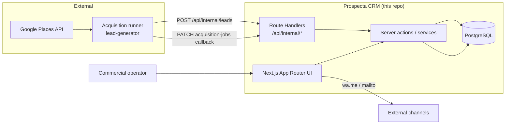

# Prospecta — Engineering Case

Public engineering case for a founder-led B2B prospecting CRM.
Claims below are grounded in this repository: code, tests, workflows, ADRs, and
[`docs/evidence/PROSPECTA_ENGINEERING_EVIDENCE.md`](../evidence/PROSPECTA_ENGINEERING_EVIDENCE.md).

**Status:** `PROSPECTA_ENGINEERING_CASE_READY`  
**Evidence source of truth:** repository artifacts (not marketing copy)  
**Companion career package:** [`career/`](./career/)

---

## 1. Executive Summary

Prospecta is a **founder-led B2B prospecting CRM**. It helps a small commercial
team turn qualified business opportunities into a weekly operating loop:
own a lead, contact via WhatsApp or e-mail, record the activity, and decide the
next step.

The product is not “another contacts database.” It is a vertical workflow:

```text
login → lead → owner → pipeline → activity → WhatsApp/e-mail → result + next step
```

Acquisition is deliberately split: an external **lead generator / acquisition
runner** collects and qualifies Google Places candidates; Prospecta remains the
**system of record** for leads, ownership, portfolio, and commercial history.

This case documents end-to-end product engineering ownership: domain modeling,
ingestion reliability under concurrency, callback idempotency, failure-aware
job contracts, PostgreSQL invariants, automated tests on real Postgres, and
CI/security gates.

It does **not** claim production SLA, exactly-once delivery, or infinite scale.

---

## 2. Product Context

### Problem

Founder-led B2B outreach fails when:

- leads arrive without ownership or next action;
- channel clicks are mistaken for real contact;
- acquisition dumps duplicates into the CRM under retries;
- weekly capacity (wallet/portfolio) drifts under concurrent callbacks.

### Product shape (as implemented)

```text
Google Places API
        ↓
prospecta-lead-generator (external runner)
  collect → qualify/score → sync
        ↓  authenticated ingest + job callbacks
Prospecta CRM (this repository)
  lead → intelligence inbox / HIGH pool → weekly portfolio
        ↓
pipeline + activities + wa.me / mailto handoff
```

Evidence for the split and contracts:

- [ADR 0009 — Google Places lead ingestion](../adr/0009-google-places-lead-ingestion.md)
- [ADR 0010 — Lead intelligence pipeline](../adr/0010-lead-intelligence-pipeline.md)
- [ADR 0014 — Acquisition runner contract](../adr/0014-acquisition-runner-contract.md)

### Who it is for

Operators and founders running outbound B2B prospecting with a small team
(`ADMIN` / `MEMBER` app roles — distinct from partnership equity roles).

### Author role in this case

End-to-end product engineering ownership of the CRM: domain, server actions,
ingestion/callback reliability, portfolio/wallet semantics, tests, and CI
gates — with acquisition compute intentionally outside the Next.js monolith.

---

## 3. Architecture

### Stack (this repository)

| Layer | Technology |
| --- | --- |
| UI | Next.js App Router, React, Chakra UI v3 |
| Backend | Next.js server actions + Route Handlers (no separate Express/BFF) |
| Data | PostgreSQL 16 + Prisma |
| Auth | HttpOnly session cookie + `Session` table |
| Machine auth | Bearer tokens for ingest (`PROSPECTA_IMPORT_TOKEN`) and acquisition jobs (`ACQUISITION_JOB_TOKEN`) |
| Rate limit | In-memory / Upstash adapters |
| CI | GitHub Actions: tests on disposable Postgres, lint, typecheck, build |
| Security gates | Gitleaks, `pnpm audit` (high+), CodeQL |

### Proven topology



Only components present in ADRs and code are shown. Scoring compute lives in
the external generator; Prospecta stores `intelligence` JSON on the lead.

### CI/CD

- [`.github/workflows/ci.yml`](../../.github/workflows/ci.yml) — serial
  `src/**/*.test.ts` against PostgreSQL 16 service + quality job
  (lint / typecheck / build)
- [`.github/workflows/security.yml`](../../.github/workflows/security.yml) —
  Gitleaks history scan, dependency audit, CodeQL
- Operational notes: [`docs/development/ci-security-gates.md`](../development/ci-security-gates.md)

---

## 4. Domain Model

Focused on decisions that matter for lifecycle and integrity (not a full schema dump).

| Entity | Role |
| --- | --- |
| `User` | Operator; app roles `ADMIN` \| `MEMBER` |
| `Session` | Server-side session rows backing HttpOnly cookies |
| `Lead` | System of record; `stage`, `ownerId`, optional `externalId`, `intelligence` |
| `Activity` | Persisted contact truth (channel click alone is not contact) |
| `WeeklyPortfolio` | Per-operator week window + target snapshot |
| `LeadAssignment` | Historical HIGH assignment; ACTIVE uniqueness enforced in SQL |
| `AcquisitionJob` | Async acquisition job + callback counters / wallet-fill metadata |

### Integrity decisions

- **External identity:** `@@unique([source, externalId])` on `Lead`
- **Active assignment:** partial unique index — one `ACTIVE` assignment per lead
  (SQL migration; Prisma cannot express the `WHERE`)
- **Active acquisition fingerprint:** partial unique index on fingerprint while
  status is `QUEUED` \| `RUNNING`
- **Ownership:** `Lead.ownerId` is the current pointer; assignments keep history
- **Wallet fill:** `AcquisitionJob.assignedCount` must not regress under
  concurrent terminal callbacks

Schema: [`prisma/schema.prisma`](../../prisma/schema.prisma)

---

## 5. Engineering Challenge — Concurrent Ingestion

### Problem

`ingestExternalLead` was check-then-act:

1. lookup by `source + externalId`
2. phone/email duplicate check
3. `create`

Under concurrency, peers passed steps 1–2 together. The database unique
constraint still prevented duplicate rows, but losers returned raw `P2002` /
conflict errors instead of a safe “already exists” result.

### Desired invariant

For the same `(source, externalId)` under concurrent ingest:

- exactly one persisted lead row;
- callers receive a successful idempotent outcome (`created: true` once,
  `created: false` for peers);
- no error storm for same-identity races.

### Solution

Application-level recovery on top of the DB unique constraint:

- same-identity phone/email hit → `{ created: false }`
- relevant `P2002` with `externalId` → re-read canonical row → `{ created: false }`
- different `externalId` colliding on phone/email → still conflict

Implementation: [`src/server/services/lead.service.ts`](../../src/server/services/lead.service.ts)  
Fix commit: `f7b9f21` — `fix: make concurrent lead ingestion idempotent`

### Where the guarantee lives

| Layer | Responsibility |
| --- | --- |
| PostgreSQL unique | Prevents duplicate `(source, externalId)` rows |
| Application catch/re-read | Converts race losers into idempotent responses |
| Tests | Lock the concurrent matrix |

This is **at-least-once request handling with idempotent outcomes**, not
exactly-once delivery.

### Validation (automated in this repo)

[`src/server/services/lead.ingest.test.ts`](../../src/server/services/lead.ingest.test.ts):

| Scenario | Created | Existing | Errors | Rows |
| ---: | ---: | ---: | ---: | ---: |
| concurrency 1 | 1 | 0 | 0 | 1 |
| concurrency 5 | 1 | 4 | 0 | 1 |
| concurrency 10 | 1 | 9 | 0 | 1 |
| concurrency 20 (`c20`) | 1 | 19 | 0 | 1 |
| 10 unique × 10 concurrent | 10 | 90 | 0 | 10 |

**Safe public wording:** validated duplicate prevention and idempotent responses
under the tested concurrent ingestion scenarios.

---

## 6. Engineering Challenge — Idempotency

### Separating terms

| Term | Meaning here |
| --- | --- |
| **Idempotency** | Repeating the same logical operation converges to the same persisted state without corrupting counters or inventing duplicates |
| **Exactly-once** | **Not claimed.** Delivery and processing can be retried; outcomes are made safe |

### Operations that may repeat

1. **Lead ingest** with the same `source + externalId` (generator retries / replays)
2. **Acquisition terminal callback** `SUCCEEDED` (lost HTTP response + retry)
3. **Wallet-fill assignment side effects** under concurrent identical callbacks
4. **Weekly portfolio get-or-create / assign** under double-submit

### Identity / dedup

- Ingest identity: `(source, externalId)` + phone/email conflict rules
- Acquisition active job: fingerprint uniqueness while non-terminal
- Wallet assignments: one `ACTIVE` per lead (partial unique index)

### Callback / lost-response behavior

[`src/server/services/acquisition-job.service.test.ts`](../../src/server/services/acquisition-job.service.test.ts):

- repeated `SUCCEEDED` does not overwrite terminal counts (lost-response safe)

Wallet-fill counters:

- derive `assignedCount` from persisted assignments
- monotonic update under `SELECT … FOR UPDATE` (`max(current, derived)`)
- identical terminal callbacks become no-ops after terminal status

Evidence + commits:

- [`docs/evidence/PROSPECTA_ENGINEERING_EVIDENCE.md`](../evidence/PROSPECTA_ENGINEERING_EVIDENCE.md)
- `9a44143` — monotonic / idempotent wallet-fill counts
- `f7b9f21` / `bb74657` — concurrent ingest fix + tests

**Safe public wording:** demonstrated idempotent behavior in the exercised
ingest and callback workflows.

---

## 7. Failure Handling

### Verified in this CRM repository

| Failure / mode | Evidence |
| --- | --- |
| Duplicate concurrent ingest races | `lead.ingest.test.ts` + `P2002` recovery |
| Lost terminal callback / retry | `acquisition-job.service.test.ts` |
| Concurrent wallet-fill callbacks corrupting counts | `wallet-fill.service.test.ts` (1/5/10/20) |
| Auth / acquisition / import token rejection | auth unit tests |
| Login / API rate limiting → HTTP 429 (and 503 when limiter unavailable) | `rate-limit*.test.ts` |
| Mutable tests blocked from production DB hosts | `production-mutation-guard` |

### Documented as cross-repo / lab (not automated here)

The evidence file records sibling-generator retry behavior and a local
crash/replay lab. Those HTTP fault codes and generator suite counts are **not**
reproduced as first-party tests in this repository, so they are **not** published
as CRM claims in this case.

**Safe public wording:** fault paths validated in CRM focus on concurrent
ingest, callback replay, wallet-fill races, auth denial, and rate-limit surfaces.

---

## 8. Crash + Replay

### CRM-side (verified)

After a job reaches `SUCCEEDED`, replaying the same terminal callback:

- keeps status terminal;
- preserves stored counts;
- does not invent additional ACTIVE overflow in the wallet-fill harness.

That covers the **lost response + retry** class on the CRM boundary.

### Cross-repo lab (partially verified via evidence doc)

[`PROSPECTA_ENGINEERING_EVIDENCE.md`](../evidence/PROSPECTA_ENGINEERING_EVIDENCE.md)
records a local lab where crash after sync / before SUCCEEDED ack, followed by
replay, converged (example N=8 → 8 rows, 0 duplicate groups). That scenario is
**not** an automated test file in this CRM repo.

**Safe public wording:** crash/replay scenarios described in the evidence pack
converged in the local lab; CRM terminal callbacks remain idempotent under
tested replay.

---

## 9. Scoring / Qualification

Prospecta stores qualification payloads on `Lead.intelligence` (score, band,
signals, pitch). Score computation runs in the external generator
([ADR 0010](../adr/0010-lead-intelligence-pipeline.md)).

The evidence document records a Generator-side Score V2 determinism check
(100 fixtures × 100 repetitions = 10,000 evaluations, zero mismatches). That
measurement is **outside this repository’s automated suite**.

**Public stance in this case:**

- VERIFIED here: CRM accepts and persists intelligence; HIGH qualification
  feeds inbox / wallet / portfolio rules.
- PARTIAL: Score V2 determinism figures live in the evidence note as
  generator-lab results — cited only with that boundary, not as CRM CI proof.

---

## 10. Testing Strategy

| Layer | What exists |
| --- | --- |
| Unit / domain | schemas, normalize, portfolio rules, auth helpers |
| Service + DB integration | Node test runner against real PostgreSQL |
| Concurrency | ingest matrix, wallet-fill callbacks, portfolio/weekly-close races |
| Idempotency / replay | ingest, acquisition callbacks, portfolio assign |
| Rate limit | adapter + surface HTTP behavior |
| E2E | Playwright (`pnpm test:e2e`); evidence notes historical isolation work |
| Fault injection (CRM) | races, token denial, rate-limit 429/503 — not full HTTP mesh to Places |

### Source suite (re-validated for this publication)

Environment: local Docker PostgreSQL 16 (`127.0.0.1:5433`), mutation guard
accepted, synthetic `@prospecta.test` data only.

| Metric | Result |
| --- | ---: |
| Tests | 346 |
| Passed | 346 |
| Failed | 0 |
| Suites | 95 |

Command equivalent to CI:

```text
tsx --test --test-concurrency=1 src/**/*.test.ts
```

E2E historical note (evidence): full suite moved from 30/65 → 64/65 after
rate-limit identity scoping; one flaky case remained. This case does **not**
claim 100% E2E.

---

## 11. CI/CD

Gates present in workflows:

| Gate | Workflow |
| --- | --- |
| PostgreSQL 16 ephemeral + migrations + full source suite | `ci.yml` |
| Lint | `ci.yml` |
| Typecheck | `ci.yml` |
| Production build (no external services) | `ci.yml` |
| Gitleaks full history | `security.yml` |
| `pnpm audit --audit-level high` | `security.yml` |
| CodeQL JS/TS security-extended | `security.yml` |

CI refuses non-loopback database hosts via the production mutation guard.

---

## 12. Security Boundaries

Documented controls (not a “secure product” slogan):

| Control | Evidence |
| --- | --- |
| HttpOnly session cookies + DB `Session` | ADR 0005, auth tests |
| Server-side `ADMIN` / `MEMBER` ACL | guards + actions |
| Import Bearer token for machine ingest | `import-token` + internal leads route |
| Acquisition job Bearer token (dispatch/callback) | ADR 0014 + token tests |
| Cron secret for weekly close | cron auth tests |
| Rate limiting on login and sensitive surfaces | rate-limit tests |
| Production mutation guard for tests/scripts | `production-mutation-guard` |
| Secret scanning / dependency / CodeQL gates | `security.yml` |

Partnership equity roles are **not** modeled as app ACL
([roles-and-governance](../founding/roles-and-governance.md)).

---

## 13. Key Architecture Decisions

| ADR | Decision |
| --- | --- |
| [0001](../adr/0001-stack-v1.md) / [0004](../adr/0004-technical-scaffold.md) | Next.js fullstack V1 |
| [0005](../adr/0005-auth-sessions-acl-v1.md) | HttpOnly sessions + ACL |
| [0006](../adr/0006-lead-foundation-v1.md)–[0008](../adr/0008-pipeline-foundation-v1.md) | Lead / activity / pipeline foundation |
| [0009](../adr/0009-google-places-lead-ingestion.md) | CRM as source of truth; Places outside monolith |
| [0010](../adr/0010-lead-intelligence-pipeline.md) | Intelligence contract on ingest |
| [0011](../adr/0011-ui-stack-keep-tailwind.md) | Chakra UI v3 (Tailwind removed) |
| [0014](../adr/0014-acquisition-runner-contract.md) | Async runner + callbacks |
| [0015](../adr/0015-whatsapp-ecosystem-readiness.md) | WhatsApp ecosystem readiness (flags / contract) |

Raw measured evidence pack:
[`docs/evidence/PROSPECTA_ENGINEERING_EVIDENCE.md`](../evidence/PROSPECTA_ENGINEERING_EVIDENCE.md)

---

## 14. Trade-offs

| Choice | Why | Cost |
| --- | --- | --- |
| DB unique + app-level P2002 recovery | Simple, no global ingest lock | Not a distributed exactly-once protocol |
| Separate transactions for assignment create vs job metadata | Smaller change surface for wallet-fill fix | Stronger atomicity would need a larger refactor (evidence) |
| Acquisition runner outside Next.js | Keeps Places keys/quota out of CRM/browser | Operational dependency on a second process |
| Offset pagination for pipeline | Shareable page URLs; measured payload win | Deep pages can drift under concurrent inserts |
| Single-replica async runner assumptions in ADR 0014 | Matches current ops | Multi-instance runner safety not proven |
| Pipeline pagination first; HIGH Pool later | Attribute perf wins cleanly | Unpaginated HIGH Pool still fails a 50k synthetic relational load in evidence |

---

## 15. Evidence

| Area | Evidence | Result |
| --- | --- | --- |
| Concurrent ingest | [`lead.ingest.test.ts`](../../src/server/services/lead.ingest.test.ts) | c1–c20 + 10×10 matrix green |
| Wallet-fill races | [`wallet-fill.service.test.ts`](../../src/server/services/wallet-fill.service.test.ts) | assignedCount stays aligned at 1/5/10/20 |
| Callback idempotency | [`acquisition-job.service.test.ts`](../../src/server/services/acquisition-job.service.test.ts) | lost-response safe |
| Source suite | local re-run + evidence | **346 / 346** pass |
| CI | [`.github/workflows/ci.yml`](../../.github/workflows/ci.yml) | Postgres tests + quality |
| Security | [`.github/workflows/security.yml`](../../.github/workflows/security.yml) | Gitleaks / audit / CodeQL |
| Pipeline listing perf | evidence doc (local synthetic) | ~1.45 MB → 215,495 bytes; c1 p99 505→48.6 ms |
| Forensic write-up | [`PROSPECTA_ENGINEERING_EVIDENCE.md`](../evidence/PROSPECTA_ENGINEERING_EVIDENCE.md) | measured local results |

---

## 16. Claim Boundaries / Limitations

### Proven in tested scenarios

- Concurrent same-`externalId` ingest converges to one row with idempotent API outcomes
- Wallet-fill concurrent terminal callbacks preserve ACTIVE / assignedCount alignment in the harness
- Terminal acquisition callbacks are replay-safe for counts
- Full CRM source suite passes against ephemeral/local PostgreSQL
- CI and security workflows encode the quality gates above

### Not proven / not claimed

- Exactly-once delivery or processing
- Production throughput, SLA, or multi-region safety
- Horizontal multi-replica runner safety
- Zero vulnerabilities / “enterprise-grade” / “bulletproof”
- Race-freedom in every topology
- Absolute guarantee against all duplicate classes beyond tested rules
- Generator HTTP fault-injection matrix as a CRM-repo automated proof
- Safe production support for 50k HIGH Pool relational loads

### Production readiness (future)

- Paginate / reshape HIGH Pool queries under large fixtures
- Stronger transactional bundling for wallet-fill create + counter update
- Multi-instance runner lease semantics if horizontally scaled
- Expand E2E stability beyond the known flaky case

---

## 17. What This Demonstrates

| Competency | Signal in Prospecta |
| --- | --- |
| Product Engineering | Vertical commercial loop; activity as contact truth; scoped ADRs |
| Full Stack | Next.js UI + server actions + Postgres + CI |
| Backend reliability | Concurrent ingest, callback idempotency, monotonic counters |
| Data integrity | Unique constraints + partial indexes + `FOR UPDATE` |
| Failure-mode thinking | Lost response, race losers, rate limits, mutation guards |
| Testing | Real Postgres suite, concurrency harnesses |
| CI/CD + security gates | Tests, lint, typecheck, build, Gitleaks, audit, CodeQL |
| Ownership | CRM system-of-record with explicit external acquisition boundary |

---

## 18. Case Differentiation — ApplyFlow vs Prospecta

Recruiters should read **two different senior signals**, not two CRMs.

| | **ApplyFlow** | **Prospecta** |
| --- | --- | --- |
| Domain | Local-first job-application workflow tooling | B2B prospecting product / CRM |
| Surface | Chrome extension + persistence evolution | Multi-user web app + acquisition ecosystem |
| Hard problems | DB concurrency in extension context, migration, AI trust boundaries | Lead generation → ingest pipeline, scoring handoff, idempotent sync, wallet callbacks |
| Reliability focus | Client/local persistence integrity | Server ingest races, retries, crash/replay at CRM boundary |
| Collaboration | Individual productivity loop | Operator portfolio, ownership, weekly capacity |

Prospecta **complements** ApplyFlow: productized multi-user backend reliability
and commercial domain design, rather than competing for the same “extension /
local-first” narrative.

---

## 19. Related artifacts

- Evidence: [`docs/evidence/PROSPECTA_ENGINEERING_EVIDENCE.md`](../evidence/PROSPECTA_ENGINEERING_EVIDENCE.md)
- Career package: [`docs/prospecta/career/`](./career/)
- Product status: [`docs/product/status-post-mvp.md`](../product/status-post-mvp.md)
