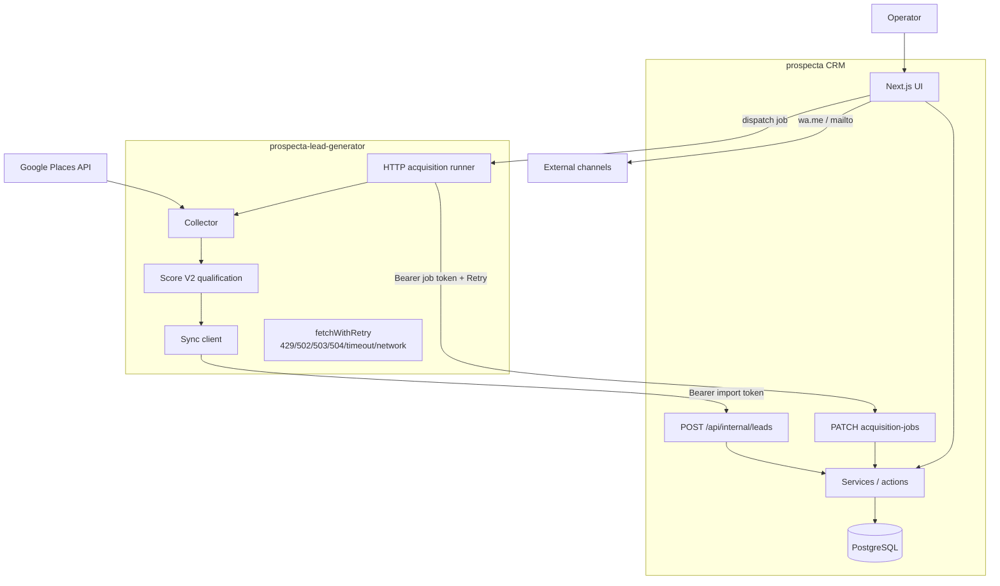

# Prospecta — Engineering Case (Ecosystem)

Public engineering case for the **Prospecta two-repository B2B prospecting
system**: Lead Generator + CRM.

**Status:** `PROSPECTA_ECOSYSTEM_ENGINEERING_CASE`  
**Companion career package:** [`career/`](./career/)

## Canonical repositories

| Role | Repository |
| --- | --- |
| CRM (system of record) | https://github.com/TraffikPro/prospecta |
| Lead Generator / acquisition runner | https://github.com/TraffikPro/prospecta-lead-generator |

Evidence packs (public docs, not production metrics):

- CRM: [`docs/evidence/PROSPECTA_ENGINEERING_EVIDENCE.md`](../evidence/PROSPECTA_ENGINEERING_EVIDENCE.md)
- Generator: [`docs/evidence/ACQUISITION_RELIABILITY_EVIDENCE.md`](https://github.com/TraffikPro/prospecta-lead-generator/blob/main/docs/evidence/ACQUISITION_RELIABILITY_EVIDENCE.md)

### Evidence classification used in this case

| Class | Meaning |
| --- | --- |
| **PUBLIC_REPRODUCIBLE** | Automated tests and/or CI on a public `main` branch |
| **PUBLIC_DOCUMENTED** | Committed evidence document; not an automated CI job for that exact number/scenario |
| **LOCAL_LAB_ONLY** | Result from local lab artifacts that are **not** committed |
| **UNSUPPORTED** | Must not appear as a public claim |

---

## 1. Executive Summary

Prospecta is a founder-led **B2B prospecting product**, not a generic contacts
CRUD. Acquisition and qualification run in a dedicated Generator; the CRM owns
leads, weekly capacity, activities, and the commercial loop:

```text
login → lead → owner → pipeline → activity → WhatsApp/e-mail → result + next step
```

Channel clicks alone are not contact — **persisted activity** is the truth.

This case covers **product engineering across both repositories**: Places
collection, Score V2 qualification, authenticated M2M sync/callbacks, concurrent
CRM ingestion, wallet assignment, pipeline, and failure-aware retries.

It does **not** claim exactly-once delivery, production SLA, or production
throughput.

---

## 2. Product Context

### Problem

Founder-led outbound fails when:

- lead discovery and CRM state live in disconnected tools;
- retries create duplicate or conflicting CRM rows;
- transient HTTP failures drop acquisition job status updates;
- weekly wallet counters drift under concurrent callbacks.

### Product flow (implemented)

```text
LEAD GENERATOR                          CRM
──────────────                          ───
Google Places discovery
        ↓
qualification / Score V2
        ↓
authenticated M2M sync  ──────────►  ingest (source + externalId)
        ↓                              ↓
job callback (retry)    ──────────►  AcquisitionJob + wallet assign
                                       ↓
                                     pipeline
                                       ↓
                                     activities / follow-ups
```

Contracts: [ADR 0009](../adr/0009-google-places-lead-ingestion.md) ·
[ADR 0010](../adr/0010-lead-intelligence-pipeline.md) ·
[ADR 0014](../adr/0014-acquisition-runner-contract.md)

---

## 3. Architecture



| Layer | CRM | Generator |
| --- | --- | --- |
| Runtime | Next.js App Router fullstack | Node TS CLI + HTTP runner |
| Data | PostgreSQL 16 + Prisma | Artifacts under `output/` (no CRM DB) |
| Auth (human) | HttpOnly session + ACL | — |
| Auth (M2M) | Import + acquisition Bearer | Same shared secrets |
| CI | Postgres tests, lint, typecheck, build, Gitleaks, audit, CodeQL | `pnpm typecheck` + `pnpm test` |

---

## 4. Domain Model (CRM)

| Entity | Role |
| --- | --- |
| `Lead` | System of record; `@@unique([source, externalId])`; `intelligence` JSON |
| `Activity` | Persisted contact truth |
| `WeeklyPortfolio` / `LeadAssignment` | Weekly HIGH capacity; one ACTIVE per lead |
| `AcquisitionJob` | Async job + wallet-fill counters |

Generator domain (separate repo): candidates → Place Details → Score V2 bands
(HIGH ≥ 70) → sync payloads with `externalId = placeId`.

---

## 5. Concurrent Ingestion (CRM)

**PUBLIC_REPRODUCIBLE**

Check-then-act races on same `(source, externalId)` used to surface `P2002`
errors despite the unique constraint. Fix: re-read canonical row and return
idempotent `{ created: false }`.

Tests: [`lead.ingest.test.ts`](../../src/server/services/lead.ingest.test.ts)

| Scenario | Created | Existing | Errors | Rows |
| ---: | ---: | ---: | ---: | ---: |
| c20 | 1 | 19 | 0 | 1 |
| 10 unique × 10 concurrent | 10 | 90 | 0 | 10 |

Not exactly-once — **idempotent outcomes under tested concurrency**.

---

## 6. Idempotency

| Boundary | Behavior | Class |
| --- | --- | --- |
| CRM ingest | Same external identity → existing lead | PUBLIC_REPRODUCIBLE |
| CRM callback | Repeated `SUCCEEDED` preserves counts | PUBLIC_REPRODUCIBLE |
| CRM wallet-fill | Monotonic `assignedCount` under `FOR UPDATE` | PUBLIC_REPRODUCIBLE |
| Generator callback HTTP | Bounded retries; permanent 4xx/500 not retried | PUBLIC_REPRODUCIBLE |

**Exactly-once remains UNSUPPORTED.**

---

## 7. Callback Retry / Failure Handling (Generator)

**PUBLIC_REPRODUCIBLE** on Generator `main` (`pnpm test` in CI).

Sources:

- [`src/http/fetch-with-retry.test.ts`](https://github.com/TraffikPro/prospecta-lead-generator/blob/main/src/http/fetch-with-retry.test.ts)
- [`src/runner/callback.test.ts`](https://github.com/TraffikPro/prospecta-lead-generator/blob/main/src/runner/callback.test.ts)
- Evidence: [ACQUISITION_RELIABILITY_EVIDENCE.md](https://github.com/TraffikPro/prospecta-lead-generator/blob/main/docs/evidence/ACQUISITION_RELIABILITY_EVIDENCE.md)

| Condition | Retried |
| --- | --- |
| 429, 502, 503, 504 | yes |
| timeout / AbortError | yes |
| network failure | yes |
| 400 / 401 / 403 / 404 / 500 | no |

CRM consumer side: lost-response-safe terminal callbacks
([`acquisition-job.service.test.ts`](../../src/server/services/acquisition-job.service.test.ts)).

---

## 8. Wallet Assignment

**PUBLIC_REPRODUCIBLE** (CRM)

Concurrent wallet-fill `SUCCEEDED` callbacks keep `ACTIVE == assignedCount`
at concurrency 1/5/10/20 in
[`wallet-fill.service.test.ts`](../../src/server/services/wallet-fill.service.test.ts).

---

## 9. Pipeline

**PUBLIC_DOCUMENTED** — **LOCAL SYNTHETIC BENCHMARK** (not production latency).

Pipeline projection + pagination reduced measured local response ~1.45 MB →
215,495 bytes and concurrency-1 p99 505 → 48.6 ms (1,000 synthetic leads).
See CRM evidence pack. Do not equate to production SLA.

---

## 10. Replay Behavior

| Scenario | Class | Notes |
| --- | --- | --- |
| CRM terminal callback replay | PUBLIC_REPRODUCIBLE | Automated CRM tests |
| Sequential same-id replay 100 unique × 10 (1000 ops → 100/900/0) | PUBLIC_DOCUMENTED | CRM evidence Phase 2; not a dedicated CI job for N=1000 |
| Crash after sync / before SUCCEEDED ack (N=8) | PUBLIC_DOCUMENTED | Written in both evidence packs; lab JSON **not** committed (`LOCAL_LAB_ONLY` artifact) |

---

## 11. Scoring / Qualification (Score V2)

| Claim | Class |
| --- | --- |
| Score V2 engine unit behavior (bands, signals, cap) | PUBLIC_REPRODUCIBLE — Generator `qualification/*.test.ts` + CI |
| CRM stores `intelligence` and uses HIGH for wallet/inbox | PUBLIC_REPRODUCIBLE — CRM ingest + portfolio paths |
| 100 fixtures × 100 reps = 10,000 evaluations / 0 mismatch | PUBLIC_DOCUMENTED — recorded in CRM evidence as Generator-side **local** check; **not** a Generator CI job |

---

## 12. Testing Strategy (both repos)

| Suite | Result | Class |
| --- | ---: | --- |
| CRM `src/**/*.test.ts` (Postgres) | **346 / 346** | PUBLIC_REPRODUCIBLE |
| Generator `src/**/*.test.ts` | **84 / 84** | PUBLIC_REPRODUCIBLE |

Suites are **independent** (different repos, different runners). Prefer stating
both numbers separately. Do **not** market a blended “430 tests” without
context — it implies one suite.

CRM CI also: lint, typecheck, build, Gitleaks, `pnpm audit --audit-level high`,
CodeQL. Generator CI: typecheck + test.

---

## 13. Cross-repository evidence table

| Area | CRM | Generator | Evidence type |
| --- | --- | --- | --- |
| Source tests | 346/346 | 84/84 | PUBLIC_REPRODUCIBLE (CI/repo) |
| Concurrent ingest | automated matrix | producer of sync traffic | PUBLIC_REPRODUCIBLE |
| Callback HTTP retries | consumer idempotency | `fetchWithRetry` + fault tests | PUBLIC_REPRODUCIBLE |
| Score V2 unit | consumer of `intelligence` | engine tests | PUBLIC_REPRODUCIBLE |
| Score V2 10k lab | evidence note | fixtures (local) | PUBLIC_DOCUMENTED |
| Sequential 1000 replay | evidence note | — | PUBLIC_DOCUMENTED |
| Crash/replay N=8 | evidence note | evidence note | PUBLIC_DOCUMENTED (lab JSON LOCAL_LAB_ONLY) |
| Pipeline perf | local synthetic | — | PUBLIC_DOCUMENTED |
| Security gates | Gitleaks/audit/CodeQL | CI verify | PUBLIC_REPRODUCIBLE |

---

## 14. Trade-offs

| Choice | Benefit | Cost |
| --- | --- | --- |
| Two repositories | Places keys/quota out of CRM; clear ownership | Cross-repo contracts + dual CI |
| DB unique + app P2002 recovery | Simple concurrent ingest | Not a distributed exactly-once protocol |
| Bounded HTTP retries (no 500 retry) | Avoid amplifying app errors | Callers must handle terminal failures |
| Single-replica runner assumptions | Operational simplicity | Multi-instance lease safety unproven |
| Pipeline pagination first | Attributable perf win | HIGH Pool large relational loads still open |

---

## 15. Claim Boundaries / Limitations

### Do not claim

- exactly-once delivery/processing
- production SLA / production throughput
- production ≡ local synthetic benchmarks
- multi-instance runner safety / multi-region guarantees
- zero production failures / zero vulnerabilities / “enterprise-grade”

### Distinguish

| Phrase | Use when |
| --- | --- |
| tested in CI / automated | PUBLIC_REPRODUCIBLE |
| documented evidence | PUBLIC_DOCUMENTED |
| local lab | LOCAL_LAB_ONLY artifacts or unqualified local runs |
| production behavior | only with production telemetry (none claimed here) |

---

## 16. Career claim tiers

See [`career/CLAIM_TIERS.md`](./career/CLAIM_TIERS.md).

---

## 17. What This Demonstrates

| Competency | Ecosystem signal |
| --- | --- |
| Product Engineering | End-to-end B2B loop across acquisition + CRM |
| Distributed product boundaries | Explicit M2M contracts between repos |
| Backend reliability | Concurrent ingest + monotonic wallet counters |
| Failure-mode thinking | Bounded retries across transient HTTP/network faults |
| Data integrity | PostgreSQL uniques, partial indexes, `FOR UPDATE` |
| Qualification systems | Score V2 in Generator; CRM as consumer |
| Testing / CI | Independent suites with gates on both repos |

---

## 18. Differentiation — ApplyFlow vs Prospecta

| | **ApplyFlow** | **Prospecta** |
| --- | --- | --- |
| Shape | Local-first Chrome MV3 tooling | Two-repo B2B product system |
| Hard problems | Persistence evolution, client concurrency, resumable migration, AI trust | Acquisition pipeline, Score V2, M2M, concurrent ingest, idempotency, bounded retries |
| Reliability | Client/local integrity | Server + cross-service failure handling |
| Collaboration | Individual workflow | Multi-operator portfolio / wallet |

Different senior signals — Prospecta complements ApplyFlow; it does not replace it.

---

## 19. Related artifacts

- CRM evidence: [`docs/evidence/PROSPECTA_ENGINEERING_EVIDENCE.md`](../evidence/PROSPECTA_ENGINEERING_EVIDENCE.md)
- Generator evidence: https://github.com/TraffikPro/prospecta-lead-generator/blob/main/docs/evidence/ACQUISITION_RELIABILITY_EVIDENCE.md
- Career package: [`docs/prospecta/career/`](./career/)
- ADRs: [`docs/adr/`](../adr/)
